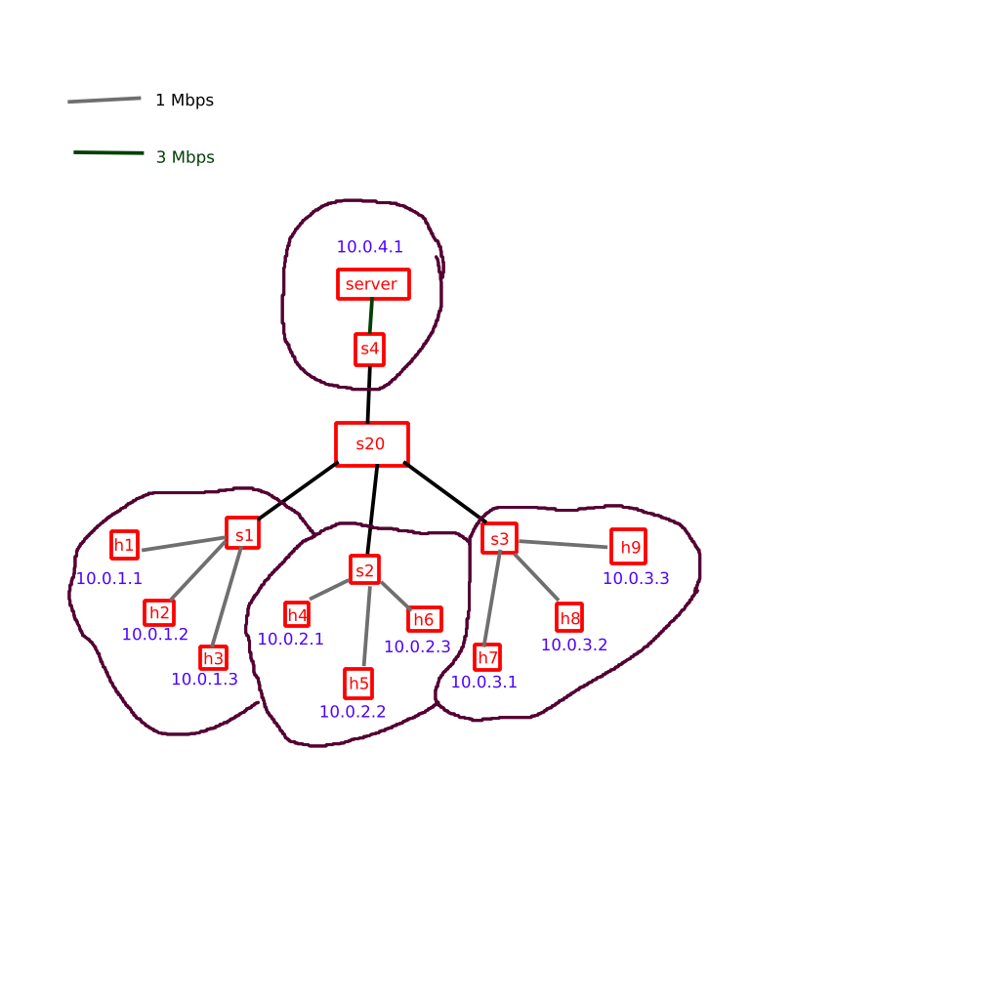

# SDN-DDoS-Mitigation-SYSC4701-Project

```
sudo apt install python3-ryu
sudo apt install python3-scapy
sudo apt install tcpreplay
```

Might have to:
```
sudo pip3 uninstall scapy
sudo apt install python3-scapy

sudo pip3 uninstall eventlet
sudo apt install python3-eventlet

sudo pip3 uninstall dnspython
sudo apt install python3-dnspython

sudo pip3 uninstall ryu
sudo apt install python3-ryu
```

To run:
```
./start.bash # without any protection
./start_ip_spoofing_prevention.bash # with IP spoofing protection
./start_ddos_mitigation.bash # with IP spoofing protection + ping flood mitigation
```

in the mininet CLI:
```
h1 ping server # this should always work when no DDoS is happening
ddos spoof server h2 h3 h4 h5 h6 h7 h8 h9 # start ddos targeted at 'server' on hosts 2-9, they all spoof their IPs
ddos normal server h2 h3 h4 h5 h6 h7 h8 h9 # start ddos targeted at 'server' on hosts 2-9, they use their IPs
```
Use CTRL+C to stop the DDoS attack

Check flows to see packet drops:
```
dpctl dump-flows
```


https://github.com/mininet/openflow-tutorial/wiki/Router-Exercise

https://opennetworking.org/wp-content/uploads/2014/10/openflow-switch-v1.5.1.pdf
https://ryu.readthedocs.io/en/latest/ofproto_v1_0_ref.html#controller-to-switch-messages
https://github.com/faucetsdn/ryu/blob/d6cda4f427ff8de82b94c58aa826824a106014c2/ryu/ofproto/ofproto_v1_3_parser.py
https://docs.openvswitch.org/en/latest/faq/openflow/

https://techhub.hpe.com/eginfolib/networking/docs/switches/5940/5200-1028b_openflow_cg/content/index.htm
